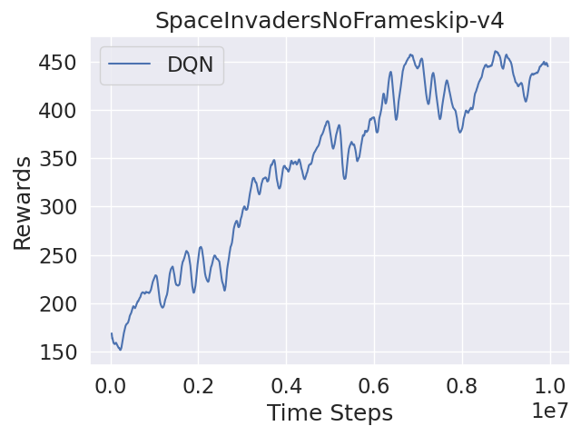
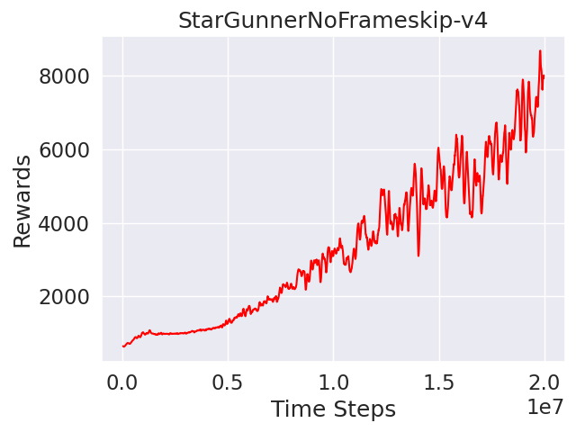

# Human Level Control Through Deep Reinforcement Learning for Games
In this repository, I have implemented a robust deep reinforcement learning algorithm designed for mastering Atari Games, drawing inspiration from the groundbreaking paper titled "[Human-level control through deep reinforcement learning.](https://www.nature.com/articles/nature14236)" The core of the implementation centers around the methodologies presented in this seminal paper.

Moreover, I have explored and incorporated additional algorithms within this repository to not only refine but also augment the efficacy of the original approach. These supplementary algorithms have been strategically chosen to optimize and enhance the overall performance of the fundamental method, contributing to a more sophisticated and capable gaming agent. The collective result is a comprehensive and evolved solution for achieving remarkable outcomes in the domain of Atari Games through deep reinforcement learning.

# Deep Q-Network(DQN):
The main algorithm which is developed in the [origin paper](https://www.nature.com/articles/nature14236) is the deep Q-network. As we know, DQN is the foundational deep reinforcement learning algorithm that uses a neural network to approximate the Q-values for each action in a given state. The key components of DQN include experience replay and target networks to stabilize and improve training. 

The loss function of DQN is typically based on the temporal difference error:

$$ \text{Loss} = \mathbb{E}\left[\left(r + \gamma \cdot \max_{a'} Q'(s', a'; \theta^-) - Q(s, a; \theta)\right)^2\right] $$

where:
- $Q(s, a; \theta)$ is the Q-value predicted by the neural network with parameters $\theta$ for the current state $s$ and action $a$,
- $r$ is the immediate reward,
- $s'$ is the next state,
- $Q'(s', a'; \theta^-)$ is the target Q-value predicted by a target network with parameters $\theta^-$,
- $\gamma$ is the discount factor.

  
**Figure 1:** The structure of DQN based on CNN. The input to NN includes an 84x84x4 image.

# Double DQN:

The contents will be updated soon!

# Results for Atari Games
|_|_|
|:---:|:---:|
| |
| |
| |

# Demos for Atari Games
|Pong(Green)|Boxing(White)|
|:---:|:---:|
| |
| |
